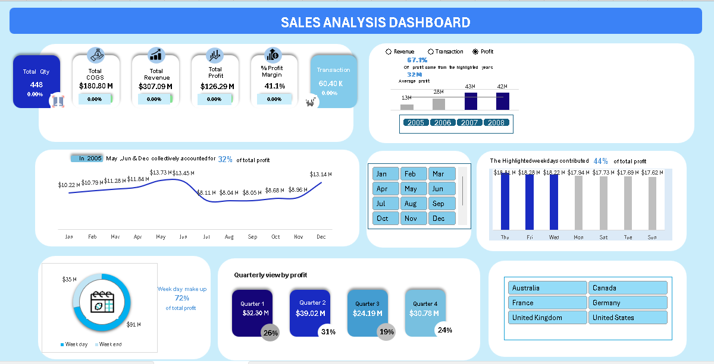

<div align="center">


<br>


<br><br>


<br>


&nbsp;

&nbsp;


</div>

---

##  &nbsp; Project Overview

<table>
<tr>
<td width="60%" valign="top">

This project delivers a **complete end-to-end business intelligence solution** built entirely in Microsoft Excel — transforming raw transactional CSV data into an **interactive executive-level dashboard**.

The solution leverages **Power Query for ETL**, **Star Schema data modelling**, **DAX for dynamic KPI calculations**, and **interactive pivot-driven dashboards** to surface revenue trends, profitability patterns, product performance, and seasonal insights.

> 💡 **Goal:** Enable data-driven decision making through clean, visual, executive-ready reporting — all within Excel.

</td>
<td width="40%" valign="top">

```yaml
Project   : Sales Analysis Dashboard
Tool      : Microsoft Excel (Advanced)
Stack     : Power Query · DAX · Power Pivot
Schema    : Star Schema
Type      : Interactive BI Dashboard
Status    : ✅ Completed
Author    : Jennisha K
Role      : Data Analyst
```

</td>
</tr>
</table>

---

##  &nbsp; KPIs at a Glance

<div align="center">

<table>
<tr>
<td align="center" width="25%">
<br>
<sub>Gross Sales Revenue</sub>
</td>
<td align="center" width="25%">
<br>
<sub>After COGS Deduction</sub>
</td>
<td align="center" width="25%">
<br>
<sub>Revenue-to-Profit Ratio</sub>
</td>
<td align="center" width="25%">
<br>
<sub>Cost of Goods Sold</sub>
</td>
</tr>
</table>

<br>

<table>
<tr>
<td align="center" width="20%">🛒 <b>109</b><br><sub>Transactions</sub></td>
<td align="center" width="20%">📦 <b>1,056</b><br><sub>Units Ordered</sub></td>
<td align="center" width="20%">✅ <b>26</b><br><sub>Sold Products</sub></td>
<td align="center" width="20%">❌ <b>580</b><br><sub>Unsold SKUs</sub></td>
<td align="center" width="20%">🏆 <b>October</b><br><sub>Best Sales Month</sub></td>
</tr>
</table>

<table>
<tr>
<td align="center" width="33%">🚲 <b>Bikes</b><br><sub>Top Revenue Category</sub></td>
<td align="center" width="33%">📅 <b>Q4</b><br><sub>Strongest Quarter · 35.1%</sub></td>
<td align="center" width="33%">📆 <b>74.9%</b><br><sub>Weekday Profit Share</sub></td>
</tr>
</table>

</div>

---

##  &nbsp; Business Questions Answered

<div align="center">

| # | Business Question | Answer |
|:---:|---|:---:|
| 01 | Which products generate the highest revenue? | 🚲 **Bikes** |
| 02 | Which quarter drives maximum profitability? | 📅 **Q4 — 35.1%** |
| 03 | Are weekday sales stronger than weekends? | ✅ **Yes — 74.9% vs 25.1%** |
| 04 | Which products are underperforming? | ⚠️ **580 unsold SKUs** |
| 05 | Which category contributes most to revenue? | 🏷️ **Bikes category** |
| 06 | What seasonal patterns affect business growth? | 📈 **H2 surge — Oct peak** |
| 07 | Which sales periods produce the best profit margin? | 🏆 **Q4 & October** |
| 08 | How can inventory planning be optimized? | 📦 **SKU rationalization** |

</div>

---

##  &nbsp; Analytics Pipeline

<div align="center">

##  &nbsp; Analytics Pipeline

<div align="center">

<table>
<tr>
<td align="center" width="14%">
<br><br>
📥<br>
<b>Raw CSV Data</b><br>
<sub>Transactional source files</sub>
</td>
<td align="center" width="2%">➡️</td>
<td align="center" width="14%">
<br><br>
🧹<br>
<b>Power Query ETL</b><br>
<sub>Clean · Transform · Merge</sub>
</td>
<td align="center" width="2%">➡️</td>
<td align="center" width="14%">
<br><br>
🧩<br>
<b>Data Model</b><br>
<sub>Star Schema · Relationships</sub>
</td>
<td align="center" width="2%">➡️</td>
<td align="center" width="14%">
<br><br>
🧮<br>
<b>DAX Calculations</b><br>
<sub>KPIs · YOY · Margins</sub>
</td>
<td align="center" width="2%">➡️</td>
<td align="center" width="14%">
<br><br>
📊<br>
<b>Pivot Tables</b><br>
<sub>Aggregations · Drill-down</sub>
</td>
<td align="center" width="2%">➡️</td>
<td align="center" width="14%">
<br><br>
📈<br>
<b>Dashboard</b><br>
<sub>Slicers · Filters · KPIs</sub>
</td>
<td align="center" width="2%">➡️</td>
<td align="center" width="14%">
<br><br>
💡<br>
<b>Insights</b><br>
<sub>Decisions · Recommendations</sub>
</td>
</tr>
</table>

<br>

| Stage | Input | Process | Output |
|:---:|---|---|---|
| 🔵 **01** | CSV Files | Import to Power Query | Raw query loaded |
| 🔵 **02** | Raw query | Clean · Deduplicate · Rename | Structured tables |
| 🟣 **03** | Clean tables | Build relationships & schema | Star schema model |
| 🟡 **04** | Data model | Write DAX measures | Dynamic KPIs |
| 🟢 **05** | DAX outputs | Create pivot aggregations | Summary tables |
| 🟢 **06** | Pivot tables | Design interactive dashboard | Live dashboard |
| 🔴 **07** | Dashboard | Analyse & interpret visuals | Business insights |

</div>
</div>

---

##  &nbsp; Technical Architecture

<div align="center">

| Layer | Technology | Role |
|:---:|:---:|---|
| 📂 **Data Source** | CSV Transaction Files | Raw input data |
| 🧹 **ETL Layer** | Power Query | Extract · Transform · Load |
| 🧩 **Modelling Layer** | Excel Data Model | Star schema relationships |
| 🧮 **Calculation Layer** | DAX Measures | Dynamic KPI computation |
| 📊 **Reporting Layer** | Pivot Tables | Aggregation & slice |
| 📈 **Visualization Layer** | Interactive Dashboard | Executive presentation |

</div>

---

##  &nbsp; Power Query — ETL Workflow

<div align="center">

Step 1 → 📥 Import raw CSV transactional data into Power Query
Step 2 → 🧹 Remove null values, duplicates, and inconsistencies
Step 3 → 🔤 Standardize headers, rename and reformat columns
Step 4 → 📅 Build a custom Date/Calendar dimension table
Step 5 → 🏷️ Add conditional columns: Weekday / Weekend flags
Step 6 → 🔗 Merge with Product lookup table (query join)
Step 7 → 📤 Load transformed queries into the Excel Data Model

</div>

---

##  &nbsp; Data Model — Star Schema

<div align="center">

##  &nbsp; Data Model — Star Schema

<div align="center">

<table>
<tr>

<td align="center" width="30%">
<br><br>

| Column | Type |
|---|---|
| 📅 Date | Date |
| 📆 Year | Integer |
| 🗓️ Quarter | Text |
| 📋 Month | Text |
| 🏷️ Day Name | Text |
| 🔖 Day Type | Text |

<br>

</td>

<td align="center" width="5%">
<br><br><br>
<b>1</b><br>
⬇️<br>
<sub>one</sub><br><br>
<b>∞</b><br>
⬆️<br>
<sub>many</sub>
</td>

<td align="center" width="30%">
<br><br>

| Column | Type |
|---|---|
| 🔑 ProductKey | FK |
| 🔑 DateKey | FK |
| 💰 Revenue | Decimal |
| 📈 Profit | Decimal |
| 💵 COGS | Decimal |
| 📦 OrderQuantity | Integer |
| 🛒 TransactionID | PK |

<br>

</td>

<td align="center" width="5%">
<br><br><br>
<b>∞</b><br>
⬇️<br>
<sub>many</sub><br><br>
<b>1</b><br>
⬆️<br>
<sub>one</sub>
</td>

<td align="center" width="30%">
<br><br>

| Column | Type |
|---|---|
| 🔑 ProductKey | PK |
| 🏷️ Product Name | Text |
| 🚲 Category | Text |
| 📂 Subcategory | Text |
| 💲 Unit Price | Decimal |
| 📊 Product Status | Text |

<br>

</td>

</tr>
</table>

<br>

<table>
<tr>
<td align="center" width="25%">
<br>
<sub>Industry standard architecture</sub>
</td>
<td align="center" width="25%">
<br>
<sub>Optimized filter flow</sub>
</td>
<td align="center" width="25%">
<br>
<sub>Fast aggregation performance</sub>
</td>
<td align="center" width="25%">
<br>
<sub>Ready for new data sources</sub>
</td>
</tr>
</table>

</div>
✅ Star Schema &nbsp;|&nbsp; ✅ Single-Direction Filtering &nbsp;|&nbsp; ✅ Optimized Performance &nbsp;|&nbsp; ✅ Scalable Model

</div>

---

##  &nbsp; DAX Measures & KPI Logic

<div align="center">

| KPI | DAX Formula | Purpose |
|:---:|---|---|
| 💰 Total Revenue | `SUM(Sales[Revenue])` | Gross sales revenue |
| 📈 Total Profit | `SUM(Sales[Profit])` | Net profit generated |
| 💵 Total COGS | `SUM(Sales[CostOfGoodsSold])` | Operational cost |
| 📦 Total Quantity | `SUM(Sales[OrderQuantity])` | Units sold |
| 🛒 Transactions | `COUNTROWS(Sales)` | Transaction volume |
| 📊 Profit Margin % | `DIVIDE([Total Profit],[Total Revenue])` | Profitability ratio |
| 📅 YOY Revenue | `CALCULATE([Revenue], SAMEPERIODLASTYEAR(...))` | Year-over-year growth |
| 🏷️ Weekday Profit | `CALCULATE([Profit], Sales[DayType]="Weekday")` | Weekday performance |
| 🚩 Revenue Flag | `IF([Revenue] > AVERAGEX(...), "Above", "Below")` | Benchmark comparison |

</div>

---

##  &nbsp; Key Business Insights

<table>
<tr>
<td width="50%" valign="top">

### 🚲 Product Performance
> Bikes dominated the revenue mix with the highest-margin SKUs driving the bulk of profitability. Premium product lines outperformed volume-based categories consistently.

### 📆 Seasonal Trends
> **October** emerged as the single highest-performing month. **Q4 captured 35.1% of total profit** — nearly double Q1 and Q2 — indicating strong end-of-year demand cycles.

</td>
<td width="50%" valign="top">

### 💰 Profitability
> The business maintained a healthy **42.6% profit margin**, generating **$1.17M net profit** on **$2.05M revenue**, reflecting strong cost control relative to COGS.

### 📦 Inventory Opportunity
> Only **26 of 606 products** recorded sales. The **580 unsold SKUs** represent a significant cost optimisation opportunity — rationalising the catalogue could unlock capital and reduce carrying costs.

</td>
</tr>
</table>

---

##  &nbsp; Performance Breakdown

<div align="center">

**Quarterly Profit Distribution**

| Quarter | Share | Visual |
|:---:|:---:|---|
| Q1 | 19.7% | `█████████░░░░░░░░░░░░░░░░░░░░` |
| Q2 | 19.4% | `█████████░░░░░░░░░░░░░░░░░░░░` |
| Q3 | 25.7% | `████████████░░░░░░░░░░░░░░░░░` |
| Q4 | **35.1%** | `█████████████████░░░░░░░░░░░░` 🏆 |

<br>

**Weekday vs Weekend**

| Segment | Share | Visual |
|:---:|:---:|---|
| 📅 Weekdays | **74.9%** | `████████████████████████████████████░░░░░░░░░░░░░` |
| 🗓️ Weekends | 25.1% | `████████████░░░░░░░░░░░░░░░░░░░░░░░░░░░░░░░░░░░░░` |

</div>

---

##  &nbsp; Business Recommendations

<div align="center">

| Priority | Recommendation | Expected Impact |
|:---:|---|:---:|
| 🔴 High | Prioritize top-performing Bike SKUs in planning | ↑ Profitability |
| 🔴 High | Review & eliminate slow-moving unsold inventory | ↓ Carrying costs |
| 🟡 Medium | Launch Q3 marketing push to close seasonal gap | ↑ Q3 revenue |
| 🟡 Medium | Improve visibility of low-performing products | ↑ SKU utilisation |
| 🟢 Low | Automate dashboard refresh with Power Query | ↑ Reporting speed |

</div>

---

##  &nbsp; Skills Demonstrated

<div align="center">


</div>

---

##  &nbsp; Repository Structure

```bash
📁 sales-analysis-power-query-dax/
│
├── 📁 Data/
│   └── sales_transactions.csv          # Raw source data
│
├── 📁 Screenshots/
│   ├── dashboard_overview.png          # Main dashboard view
│   ├── power_query_steps.png           # ETL workflow
│   ├── data_model.png                  # Star schema diagram
│   └── dax_measures.png                # DAX measure list
│
├── 📁 Docs/
│   └── project_notes.md                # Methodology notes
│
├── 📄 sales_analysis.xlsm              # Main Excel workbook
├── 📄 README.md                        # Project documentation
└── 📄 .gitignore                       # Git ignore rules
```

---

##  &nbsp; How to Use

<div align="center">

| Step | Action | Note |
|:---:|---|---|
| 1️⃣ | Download `sales_analysis.xlsm` | Clone or download ZIP |
| 2️⃣ | Open in Microsoft Excel | Excel 2016+ recommended |
| 3️⃣ | **Enable Macros** when prompted | Required for full functionality |
| 4️⃣ | Navigate to the **Dashboard** sheet | Main interactive view |
| 5️⃣ | Use **slicers** to filter by Year / Category / Product | Dynamic filtering |
| 6️⃣ | Explore **Power Pivot** for the data model | Data → Manage Data Model |

</div>

---

##  &nbsp; Author

<div align="center">


<br><br>

[](mailto:jennisha97@gmail.com)
&nbsp;
[](https://www.linkedin.com/in/jennisha-k-66a195191)

</div>

---
## 🖼️ Dashboard Screenshots

<div align="center">

### 📊 Main Dashboard Overview



Interactive sales dashboard designed to monitor revenue, profit, transactions, product performance, and seasonal trends using KPI cards, Pivot Charts, slicers, and dynamic reporting.

---


<br>

<div align="center">


</div>

