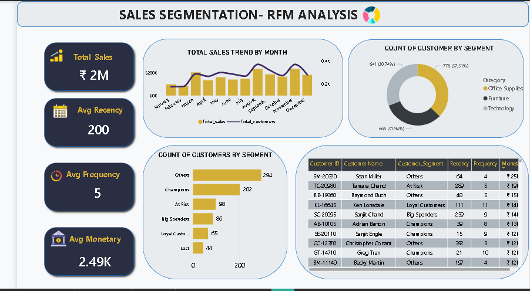

# 📊 Sales Segmentation – RFM Analysis | Power BI Dashboard


> **Segmenting 789 customers using RFM (Recency, Frequency, Monetary) methodology to uncover Champions, At-Risk, Lost, and other behavioral segments from 8,511 retail transactions.**

---

## 📸 Dashboard Preview



---

## 🧠 Project Overview

This Power BI project applies **RFM-based customer segmentation** on the Superstore 2025 dataset — 8,511 rows of US retail transactions across Furniture, Office Supplies, and Technology categories — spanning the year 2024.

RFM analysis answers three business-critical questions:

| Dimension | Question | How It's Measured |
|---|---|---|
| 🕐 **Recency** | How recently did the customer buy? | Days since last order vs. max order date |
| 🔁 **Frequency** | How often do they buy? | Distinct order count per customer |
| 💰 **Monetary** | How much do they spend? | Total sales value per customer |

Each customer is scored 1–5 on all three dimensions and assigned to a **business segment** — enabling data-driven targeting and retention strategies.

---

## 📌 Dataset Overview

| Field | Detail |
|---|---|
| Source | Superstore 2025 (US Retail) |
| Total Rows | 8,511 transactions |
| Unique Customers | 789 |
| Unique Orders | 4,251 |
| Total Sales | ₹ 19,65,639 (~₹ 2M) |
| Categories | Furniture, Office Supplies, Technology |
| Customer Segments | Consumer, Corporate, Home Office |
| Regions | East, West, Central, South |
| Sub-Categories | 17 |
| Date Range | 2024 (Jan–Dec) |

**Columns in dataset:**
`Row ID` · `Order ID` · `Order Date` · `Ship Mode` · `Customer ID` · `Customer Name` · `Segment` · `Country/Region` · `City` · `State` · `Postal Code` · `Region` · `Product ID` · `Category` · `Sub-Category` · `Product Name` · `Sales` · `Quantity` · `Discount` · `Profit`

---

## 📊 Dashboard KPIs

| Metric | Value |
|---|---|
| 💰 Total Sales | ₹ 2M |
| 📅 Avg Recency | 200 days |
| 🔁 Avg Frequency | 5 orders |
| 💵 Avg Monetary | ₹ 2.49K |

---

## 👥 RFM Customer Segments

| Segment | Count | Description |
|---|---|---|
| 🏆 Champions | 202 | Bought recently, buy often, spend the most |
| ⚠️ At Risk | 98 | Were good customers — haven't purchased recently |
| 💎 Loyal Customers | 65 | Frequent buyers with consistent engagement |
| 💸 Big Spenders | 86 | High monetary value, lower recency |
| 📉 Lost | 44 | Lowest RFM scores across all 3 dimensions |
| 🔵 Others | 294 | Mixed patterns, not fitting above categories |

---

## 🗂️ Data Model

| Table | Type | Purpose |
|---|---|---|
| `Superstore 2025` | Fact | Raw transactional data (8,511 rows) |
| `RFM_Calculation` | Calculated Table | Aggregated RFM scores per customer |
| `DateTable` | Dimension | Calendar table for time intelligence |
| `Tbl_Measure` | Measure Table | All DAX KPI measures |

---

## 🧮 DAX — Full Reference

---

### 📁 Tbl_Measure Table — KPI Measures

> 🔵 These are **measures** stored in the `Tbl_Measure` table.

```dax
MaxOrderDate = MAX('Superstore 2025'[Order Date])
```

```dax
Total Customers = DISTINCTCOUNT('Superstore 2025'[Customer ID])
```

```dax
Total Sales = SUM('Superstore 2025'[Sales])
```

```dax
AvgRecency = AVERAGE(RFM_Calculation[Recency])
```

```dax
AvgFrequency = AVERAGE(RFM_Calculation[Frequency])
```

```dax
AvgMonetary = AVERAGE(RFM_Calculation[Monetary])
```

---

### 📈 YoY Variance Measures

> 🔵 Dynamic text measures showing Year-over-Year change with ▲ ▼ indicators.

```dax
YoY SalesVariance =
 VAR LY = CALCULATE([Total Sales], SAMEPERIODLASTYEAR(DateTable[Date]))
 VAR LYFormatted = FORMAT(LY/1000, "$#,0") & "K"
 VAR yoyCalc = DIVIDE([Total Sales] - LY, LY)
 VAR yoyCalcFormatted = FORMAT(yoyCalc, "0.0%; (0.0%)")
 RETURN
  SWITCH(
    TRUE(),
    yoyCalc > 0,   UNICHAR(9650) & " " & yoyCalcFormatted & " | LY " & LYFormatted,
    ISBLANK(LY),   UNICHAR(8211) & " | No Data for Last Year",
    yoyCalc = 0,   UNICHAR(8211) & " | No Change from Last Year",
                   UNICHAR(9660) & " " & yoyCalcFormatted & " | LY " & LYFormatted)
```

```dax
YoY FrequencyVar =
 VAR LY = CALCULATE([AvgFrequency], SAMEPERIODLASTYEAR(DateTable[Date]))
 VAR LYFormatted = FORMAT(LY, "#,0")
 VAR yoyCalc = DIVIDE(([AvgFrequency] - LY), LY)
 VAR yoyCalcFormatted = FORMAT(yoyCalc, "0.0%;(0.0%)")
 RETURN
  SWITCH(
    TRUE(),
    yoyCalc > 0,   UNICHAR(9650) & " " & yoyCalcFormatted & " | LY " & LYFormatted,
    ISBLANK(LY),   UNICHAR(8211) & " | No Data for Last Year ",
                   UNICHAR(9660) & " " & yoyCalcFormatted & " | LY " & LYFormatted)
```

```dax
YoY MonetaryVar =
 VAR LY = CALCULATE([AvgMonetary], SAMEPERIODLASTYEAR(DateTable[Date]))
 VAR LYFormatted = FORMAT(LY/1000, "$#,0.00") & "K"
 VAR yoyCalc = DIVIDE(([AvgMonetary] - LY), LY)
 VAR yoyCalcFormatted = FORMAT(yoyCalc, "0.0%;(0.0%)")
 RETURN
  SWITCH(
    TRUE(),
    yoyCalc > 0,   UNICHAR(9650) & " " & yoyCalcFormatted & " | LY " & LYFormatted,
    ISBLANK(LY),   UNICHAR(8211) & " | No Data for Last Year ",
                   UNICHAR(9660) & " " & yoyCalcFormatted & " | LY " & LYFormatted)
```

```dax
YoY RecencyVar =
 VAR LY = CALCULATE([AvgRecency], SAMEPERIODLASTYEAR(DateTable[Date]))
 VAR LYFormatted = FORMAT(LY, "#,0")
 VAR yoyCalc = DIVIDE(([AvgRecency] - LY), LY)
 VAR yoyCalcFormatted = FORMAT(yoyCalc, "0.0%;(0.0%)")
 RETURN
  SWITCH(
    TRUE(),
    yoyCalc > 0,   UNICHAR(9650) & " " & yoyCalcFormatted & " | LY " & LYFormatted,
    ISBLANK(LY),   UNICHAR(8211) & " | No Data for Last Year ",
                   UNICHAR(9660) & " " & yoyCalcFormatted & " | LY " & LYFormatted)
```

---

### 🎨 Dynamic YoY Color Measures

> 🟢 Green = improvement &nbsp;|&nbsp; 🔴 Red = decline &nbsp;|&nbsp; 🟠 Orange = no prior year data

```dax
salesYoYColor =
 VAR LY  = CALCULATE([Total Sales], SAMEPERIODLASTYEAR(DateTable[Date]))
 VAR YOY = DIVIDE([Total Sales] - LY, LY)
 RETURN SWITCH(TRUE(),
    YOY > 0,              "#00B200",
    OR(ISBLANK(LY),LY=0), "Orange",
                          "#FF0000")
```

```dax
FrequencyYoYColor =
 VAR LY  = CALCULATE([AvgFrequency], SAMEPERIODLASTYEAR(DateTable[Date]))
 VAR YOY = DIVIDE([AvgFrequency] - LY, LY)
 RETURN SWITCH(TRUE(),
    YOY > 0,              "#00B200",
    OR(ISBLANK(LY),LY=0), "Orange",
                          "#FF0000")
```

```dax
monetaryYoYColor =
 VAR LY  = CALCULATE([AvgMonetary], SAMEPERIODLASTYEAR(DateTable[Date]))
 VAR YOY = DIVIDE([AvgMonetary] - LY, LY)
 RETURN SWITCH(TRUE(),
    YOY > 0,              "#00B200",
    OR(ISBLANK(LY),LY=0), "Orange",
                          "#FF0000")
```

```dax
recencyYoYColor =
 VAR LY  = CALCULATE([AvgRecency], SAMEPERIODLASTYEAR(DateTable[Date]))
 VAR YOY = DIVIDE([AvgRecency] - LY, LY)
 RETURN SWITCH(TRUE(),
    YOY > 0,              "#00B200",
    OR(ISBLANK(LY),LY=0), "Orange",
                          "#FF0000")
```

---

### 📅 DateTable — Calculated Table

> 🟣 This is a **calculated table** created using DAX in the Data Model.

```dax
DateTable =
ADDCOLUMNS (
    CALENDAR(DATE(2021,1,1), DATE(2025,12,31)),
    "Year",         YEAR([Date]),
    "Month Number", MONTH([Date]),
    "Month Name",   FORMAT([Date], "MMMM"),
    "Year-Month",   FORMAT([Date], "YYYY-MM"),
    "Quarter",      "Q" & FORMAT([Date], "Q"),
    "Day",          DAY([Date]),
    "Day of Week",  WEEKDAY([Date], 2),
    "Day Name",     FORMAT([Date], "dddd"),
    "Week Number",  WEEKNUM([Date], 2)
)
```

---

### 🧮 RFM_Calculation — Calculated Table

> 🟣 This is a **calculated table** — summarises one row per customer with Recency, Frequency, Monetary values.

```dax
RFM_Calculation =
SUMMARIZE(
    'Superstore 2025',
    'Superstore 2025'[Customer ID],
    'Superstore 2025'[Customer Name],
    "Recency",   DATEDIFF(
                    CALCULATE(MAX('Superstore 2025'[Order Date])),
                    CALCULATE(MAX('Superstore 2025'[Order Date]), ALL('Superstore 2025')),
                    DAY),
    "Frequency", DISTINCTCOUNT('Superstore 2025'[Order ID]),
    "Monetary",  SUM('Superstore 2025'[Sales])
)
```

---

### 🏷️ Calculated Columns — inside RFM_Calculation Table

> 🟡 These are **calculated columns** added directly inside the `RFM_Calculation` table. They are evaluated row by row.

**Recency_Score** — Ranks customers by recency (lower days = better score)
```dax
Recency_Score =
 VAR RankRecency = RANKX(ALL(RFM_Calculation), RFM_Calculation[Recency],, ASC)
 VAR TotalCust   = COUNTROWS(ALL(RFM_Calculation))
 RETURN CEILING(DIVIDE(RankRecency * 5, TotalCust), 1)
```

**Frequency_Score** — Ranks customers by order count (higher = better score)
```dax
Frequency_Score =
 VAR RankFreq  = RANKX(ALL(RFM_Calculation), RFM_Calculation[Frequency],, DESC)
 VAR TotalCust = COUNTROWS(ALL(RFM_Calculation))
 RETURN CEILING(DIVIDE(RankFreq * 5, TotalCust), 1)
```

**Monetary_Score** — Ranks customers by total spend (higher = better score)
```dax
Monetary_Score =
 VAR RankMon   = RANKX(ALL(RFM_Calculation), RFM_Calculation[Monetary],, DESC)
 VAR TotalCust = COUNTROWS(ALL(RFM_Calculation))
 RETURN CEILING(DIVIDE(RankMon * 5, TotalCust), 1)
```

**Customer_Segment** — Assigns final segment label based on score combinations
```dax
Customer_Segment =
SWITCH(
    TRUE(),
    -- 🏆 Champions: best across all 3 dimensions
    RFM_Calculation[Recency_Score]   <= 2 &&
    RFM_Calculation[Frequency_Score] <= 2 &&
    RFM_Calculation[Monetary_Score]  <= 2,  "Champions",

    -- 💎 Loyal Customers: frequent and fairly recent
    RFM_Calculation[Frequency_Score] <= 2 &&
    RFM_Calculation[Recency_Score]   <= 3,  "Loyal Customers",

    -- 💸 Big Spenders: high spend but not recent
    RFM_Calculation[Monetary_Score]  <= 2 &&
    RFM_Calculation[Recency_Score]   >= 3,  "Big Spenders",

    -- ⚠️ At Risk: used to buy often but recency is dropping
    RFM_Calculation[Recency_Score]   >= 3 &&
    RFM_Calculation[Frequency_Score] <= 3,  "At Risk",

    -- 📉 Lost: worst scores across all 3 metrics
    RFM_Calculation[Recency_Score]   =  5 &&
    RFM_Calculation[Frequency_Score] =  5 &&
    RFM_Calculation[Monetary_Score]  =  5,  "Lost",

    -- 🔵 Default
    "Others"
)
```

---

### 📌 DAX Object Types — Quick Reference

| Symbol | Type | What It Is |
|---|---|---|
| 🔵 | **Measure** | Calculated at query time, context-aware, stored in Measure table |
| 🟣 | **Calculated Table** | Created once at refresh, lives in the data model |
| 🟡 | **Calculated Column** | Row-level computation, stored inside a table |

---

## 📊 Visuals in the Dashboard

- **KPI Cards** — Total Sales, Avg Recency, Avg Frequency, Avg Monetary (with YoY color indicators)
- **Total Sales Trend by Month** — Combo chart: bar (Total Sales) + line (Total Customers)
- **Count of Customers by Segment** — Horizontal bar chart
- **Count of Customer by Segment (Category)** — Donut chart split by Furniture / Office Supplies / Technology
- **Customer RFM Detail Table** — Customer ID, Name, Segment, Recency, Frequency, Monetary

---

## 🔍 Business Insights

- **Champions (202 customers)** are the highest value group — reward with loyalty programs and early-access offers.
- **At Risk (98 customers)** were once active but show declining engagement — win-back campaigns with personalized offers recommended.
- **Lost (44 customers)** scored lowest across all 3 RFM dimensions — analyze exit patterns to prevent future churn.
- **Big Spenders (86 customers)** have high monetary value but lower recency — re-engagement emails can revive them.
- **Technology** drives the highest per-order value; **Office Supplies** generates high frequency but lower average ticket size.
- Seasonal spike observed in **November–December**, indicating strong year-end buying behaviour.

---

## 🗃️ Repository Structure

```
📁 Sales-RFM-Analysis-PowerBI/
│
├── 📄 README.md
├── 📊 Sales_RFM.pbix
├── 📁 assets/
│   └── Sales_RFM_Dashboard.png
├── 📁 data/
│   └── Superstore_2025.csv
└── 📁 dax/
    └── DAX_Used.docx
```

---

## 🛠️ Tools & Technologies

| Tool | Usage |
|---|---|
| Power BI Desktop | Dashboard design, RFM visualisation |
| DAX | Measures, calculated tables, scoring logic, YoY analysis |
| Power Query (M) | Data transformation & cleaning |
| Excel / CSV | Source data — Superstore_2025 |

---

## 🚀 How to Use

1. Clone or download this repository
2. Open `Sales_RFM.pbix` in **Power BI Desktop**
3. Update the data source path to your local `Superstore_2025.csv` if prompted
4. Refresh the dataset — all RFM scores and segments auto-calculate via DAX
5. Explore all 3 report pages: `Sales_RFM`, `Page1`, `Duplicate of Sales_RFM`

---

## 👩‍💻 About Me

**Jennisha K** | Data Analyst | Chennai, India

Skilled in Power BI · SQL · Tableau · Excel · Python
Domain: Banking, Financial Services & Retail Analytics
Actively seeking Data Analyst / MIS Analyst / Power BI Developer roles

[](https://linkedin.com/in/your-profile)
[](https://github.com/your-username)

---

*⭐ If this project helped you, give it a star!*
